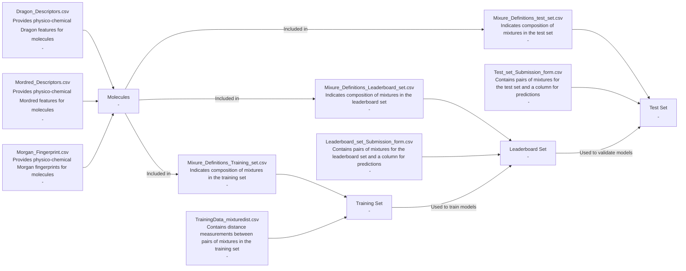

<p float="right">
  
</p>

<h1 float="left">
Gin
</h1>

This repository contains code for exploring and analyzing data for the DREAM Olfaction Challenge as well as Pyrfume odorant data. 

The goal of the challenge is to
- develop models that can predict how close two mixtures of molecules are in the odor perceptual space using physical and chemical featuress
- or single odorant for certain Pyrfume data.

## Data

### Pyrfume
The data is managed by the [Pyrfume project](https://pyrfume.org/), containing SMILES strings representing molecular structures and their corresponding binary labels.

### DREAM Challenge Data
Below, providing an abbreviated challenge description from [Synapse website](https://www.synapse.org/#!Synapse:syn53470621/wiki/627282):

```markdown
#### Background

Olfaction—the sense of smell—is the least understood of our senses. We use it constantly in our daily lives—choosing food that is not spoiled, as an early-warning sign of a gas leak or a fire, and in the enjoyment of perfume and wine. Recent advances have helped predict what a molecule will smell like, given its chemical structure. This is known as the stimulus-percept problem, which was solved long ago for color vision and tone hearing.

For this challenge, we are providing a large published training set of 500 mixtures measurements obtained from 3 publications, and an unpublished test set of 46 equi-intense mixtures of 10 molecules whose distance was rated by 35 human subjects.

#### Task

The goal of the DREAM Olfaction Challenge is to find models that can predict how close two mixtures of molecules are in the odor perceptual space (on a 0-1 scale, where 0 is total overlap and 1 is the furthest away) using physical and chemical features.

#### Data Files

- `Dragon_Descriptors.csv`: Provides the physico-chemical Dragon features for all molecules in the training, leaderboard, and test sets, plus extra molecules if needed.
- `Mordred_Descriptors.csv`: Provides the physico-chemical Mordred features for all molecules in the training, leaderboard, and test sets.
- `Morgan_Fingerprint.csv`: Provides the physico-chemical Morgan fingerprints for all molecules in the training, leaderboard, and test sets.
- `Mixure_Definitions_Training_set.csv`: Indicates the composition of each mixture in the training set.
- `TrainingData_mixturedist.csv`: Contains distance measurements between pairs of mixtures in the training set.
- `Mixure_Definitions_Leaderboard_set.csv`: Indicates the composition of each mixture in the leaderboard set.
- `Leaderboard_set_Submission_form.csv`: Contains pairs of mixtures for the leaderboard set and a column for your prediction.
- `Mixure_Definitions_test_set.csv`: Indicates the composition of each mixture in the test set.
- `Test_set_Submission_form.csv`: Contains pairs of mixtures for the test set and a column for your prediction.
```



## Installation

To install the package, run:

```bash
pip install -e .
```

## Project Structure

- `tonic/`
  - `data.py`: Contains functions to read and download data.
  - `explore.py`: Contains functions to visualize data.
  - `features.py`: Contains functions to generate molecular features.
  - `gnn.py`: Contains the implementation of the Graph Neural Network model.
  - `validate.py`: Contains functions to evaluate model performance.
- `notebooks/`: Contains Jupyter notebooks for data exploration and model development.
- `tests/`: Contains unit tests for the codebase - only implemented a few just to showcase good practices.

## Workflow

### Data Loading and Preprocessing

Data is loaded using the `read_local_csv` function from `tonic.data`. Molecular fingerprints are generated using `featurize_smiles` from `tonic.features`.

### Random Forest Model

#### Training with SMOTE

```python
import numpy as np
from sklearn.ensemble import RandomForestClassifier
from sklearn.model_selection import train_test_split
from imblearn.over_sampling import SMOTE
from tonic.data import read_local_csv
from tonic.features import featurize_smiles
from tonic.validate import evaluate_model, plot_confusion_matrix

# Read the CSV data
data_df = read_local_csv()

# Extract features and labels
x = np.array([featurize_smiles(smiles) for smiles in data_df.index])
y = data_df['floral'].values

# Split data into training and testing sets
X_train, X_test, y_train, y_test = train_test_split(x, y, test_size=0.2, random_state=42)

# Apply SMOTE to the training data
smote = SMOTE(random_state=42)
X_train_res, y_train_res = smote.fit_resample(X_train, y_train)

# Train a Random Forest model
rf_model = RandomForestClassifier(random_state=42)
rf_model.fit(X_train_res, y_train_res)

# Evaluate the model
rf_y_pred = rf_model.predict(X_test)

evaluate_model(y_test, rf_y_pred)
plot_confusion_matrix(y_test, rf_y_pred)
```

### Graph Neural Network (GNN) Model

#### Training

```python
import torch
from torch_geometric.data import DataLoader
from tonic.data import read_local_csv
from tonic.features import smiles_to_graph
from tonic.extra.gnn import train_gnn_model
from tonic.extra.features import normalize_data_list

# Read the CSV data
data_df = read_local_csv()

# Convert SMILES strings to graph data
data_list = [smiles_to_graph(smiles) for smiles in data_df.index if smiles_to_graph(smiles) is not None]
for data, label in zip(data_list, data_df['floral']):
    data.y = torch.tensor([label], dtype=torch.float)

# Normalize the data
data_list = normalize_data_list(data_list)

# Split data into training and testing sets
train_data, test_data = train_test_split(data_list, test_size=0.2, random_state=42)

# Train the GNN model
model = train_gnn_model(train_data, num_epochs=200, batch_size=32)
torch.save(model.state_dict(), 'gnn_model.pth')
```

#### Monitoring

During training, log files are written to ./runs/ regarding the loss, y_pred, and y distributions.

Monitor training with `tensorboard --logdir=./runs`

#### Evaluation

```python
from tonic.validate import evaluate_model, plot_confusion_matrix

model.eval()
test_loader = DataLoader(test_data, batch_size=256, shuffle=False)

all_preds = []
all_labels = []

with torch.no_grad():
    for batch in test_loader:
        preds = model(batch.x, batch.edge_index, batch.edge_attr, batch.batch)
        all_preds.extend(preds.numpy().flatten())
        all_labels.extend(batch.y.numpy().flatten())

evaluate_model(all_labels, all_preds > 0.5)
plot_confusion_matrix(all_labels, all_preds > 0.5)
```

## Testing

Unit tests are located in the `tests/` directory. I only implemented a few to showcase good practices. Can be run using pytest:

```bash
pytest
```

