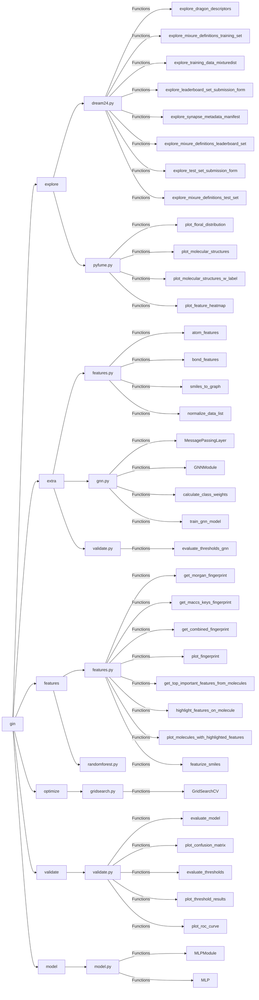

```mermaid
graph LR
     A[gin] --> B[explore]
     A --> C[extra]
     A --> D[features]
     A --> E[optimize]
     A --> F[validate]
     A --> G[model]

     B --> B1[dream24.py]
     B --> B2[pyfume.py]

     C --> C1[features.py]
     C --> C2[gnn.py]
     C --> C3[validate.py]

     D --> D1[features.py]
     D --> D2[randomforest.py]

     E --> E1[gridsearch.py]

     F --> F1[validate.py]

     G --> G1[model.py]

     B1 --> |Functions| B1_1[explore_dragon_descriptors]
     B1 --> |Functions| B1_2[explore_mixure_definitions_training_set]
     B1 --> |Functions| B1_3[explore_training_data_mixturedist]
     B1 --> |Functions| B1_4[explore_leaderboard_set_submission_form]
     B1 --> |Functions| B1_5[explore_synapse_metadata_manifest]
     B1 --> |Functions| B1_6[explore_mixure_definitions_leaderboard_set]
     B1 --> |Functions| B1_7[explore_test_set_submission_form]
     B1 --> |Functions| B1_8[explore_mixure_definitions_test_set]

     B2 --> |Functions| B2_1[plot_floral_distribution]
     B2 --> |Functions| B2_2[plot_molecular_structures]
     B2 --> |Functions| B2_3[plot_molecular_structures_w_label]
     B2 --> |Functions| B2_4[plot_feature_heatmap]

     C1 --> |Functions| C1_1[atom_features]
     C1 --> |Functions| C1_2[bond_features]
     C1 --> |Functions| C1_3[smiles_to_graph]
     C1 --> |Functions| C1_4[normalize_data_list]

     C2 --> |Functions| C2_1[MessagePassingLayer]
     C2 --> |Functions| C2_2[GNNModule]
     C2 --> |Functions| C2_3[calculate_class_weights]
     C2 --> |Functions| C2_4[train_gnn_model]

     C3 --> |Functions| C3_1[evaluate_thresholds_gnn]

     D1 --> |Functions| D1_1[get_morgan_fingerprint]
     D1 --> |Functions| D1_2[get_maccs_keys_fingerprint]
     D1 --> |Functions| D1_3[get_combined_fingerprint]
     D1 --> |Functions| D1_4[plot_fingerprint]
     D1 --> |Functions| D1_5[get_top_important_features_from_molecules]
     D1 --> |Functions| D1_6[highlight_features_on_molecule]
     D1 --> |Functions| D1_7[plot_molecules_with_highlighted_features]
     D1 --> |Functions| D1_8[featurize_smiles]

     E1 --> |Functions| E1_1[GridSearchCV]

     F1 --> |Functions| F1_1[evaluate_model]
     F1 --> |Functions| F1_2[plot_confusion_matrix]
     F1 --> |Functions| F1_3[evaluate_thresholds]
     F1 --> |Functions| F1_4[plot_threshold_results]
     F1 --> |Functions| F1_5[plot_roc_curve]

     G1 --> |Functions| G1_1[MLPModule]
     G1 --> |Functions| G1_2[MLP]
```
